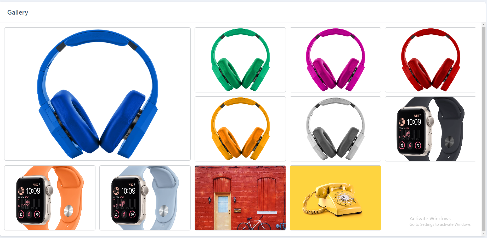
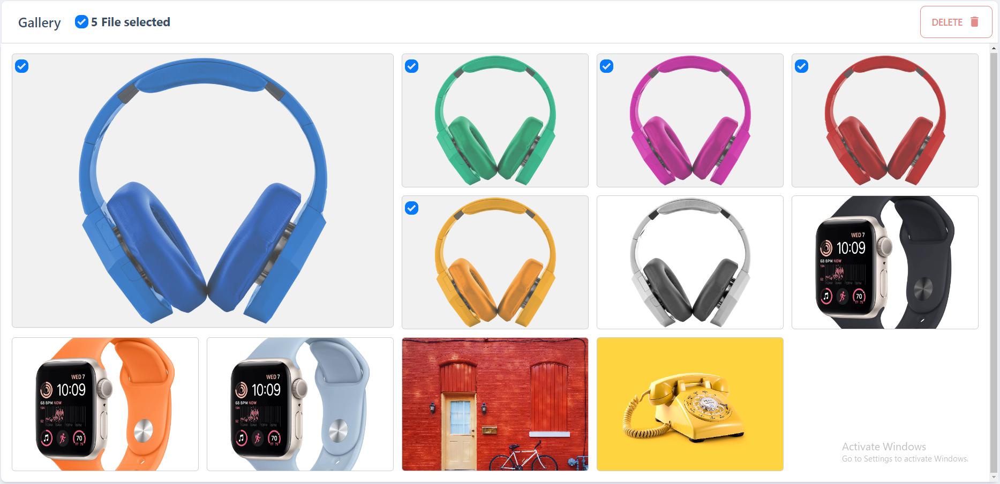
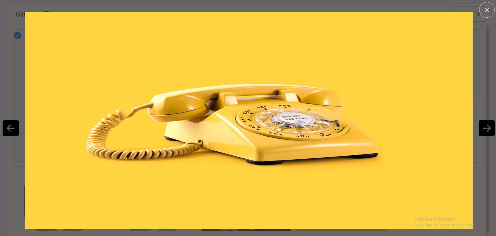

# Photo Gallery

## Overview

Users Should be able

- View the optimal layout for the app depending on their device's screen size
- See hover states for all interactive elements on the page
- Navigate the slideshow and view each image
- User able to select multiple images and  delete them
- User able to sort image order by drag and drop
- Also user can  select image as feature photo

## Screenshots

## Setup

To run this project locally:

`npm install && npm run dev`

or

`yarn && yarn run dev`

## Build With

- React.js
- Redux Toolkit
- Framer-Motion
- tailwindcss
- dnd-kit